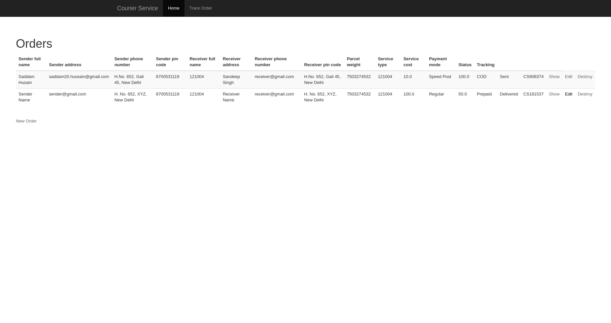
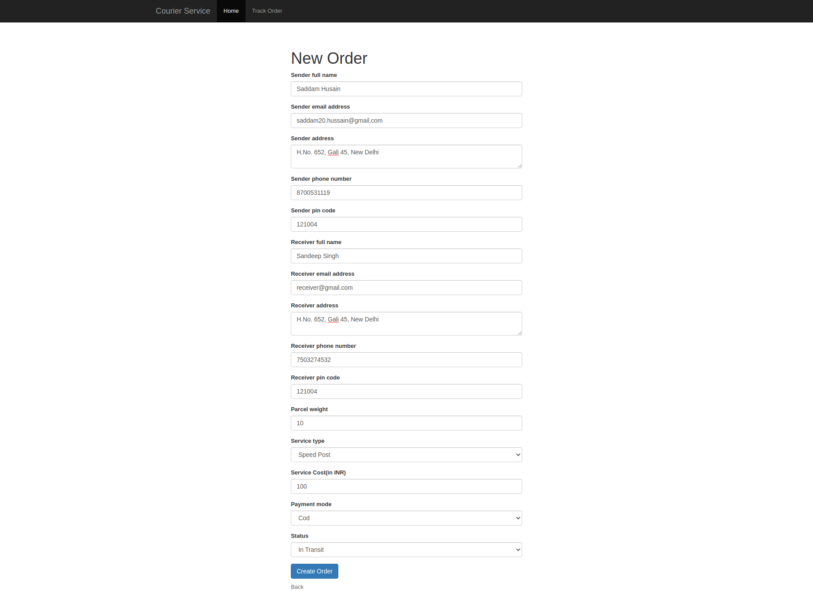
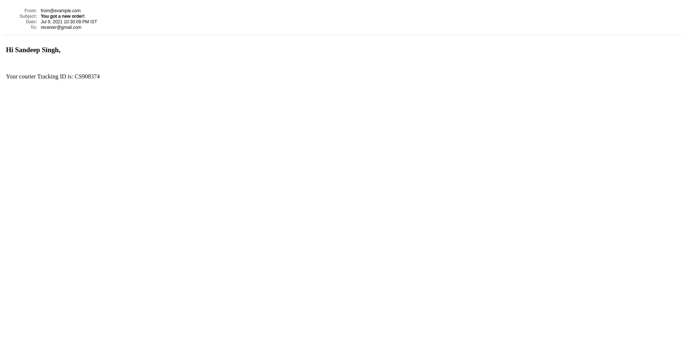
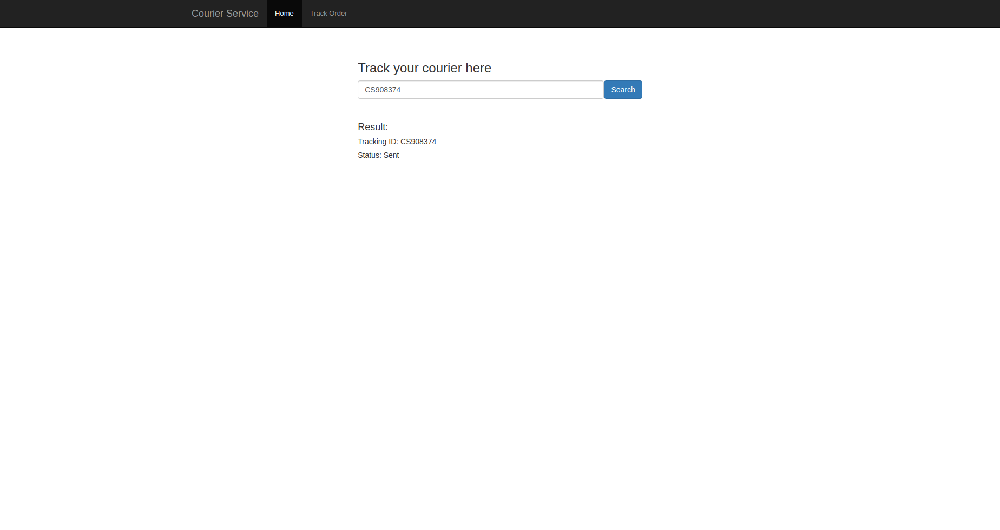

# TV Series Assignment

This is an assignent.

## Getting started

To get started with the app, first clone the repo and `cd` into the directory:

```
$ git clone https://github.com/awsmsid/courier_service.git
$ cd courier_service
```

Then use the ruby-3.0.1:

```
$ rvm use 3.0.1
```

Install the needed gems:

```
$ bundle install
```

Install JavaScript dependencies:

```
$ yarn install
```

Next, create db and migrate the database:

```
$ rails db:create db:migrate
```

run the app in a local server:

```
$ rails server
```

Courier list page:



Courier form:


Sender Email:


Receiver Email:


Search Tracking ID:
